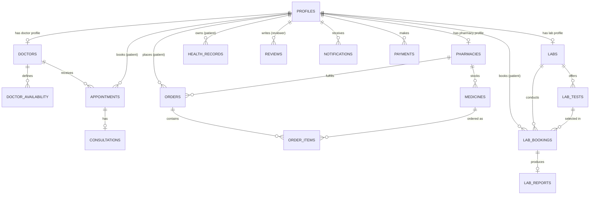

# Curely — Database Architecture & Migrations

This directory contains the PostgreSQL migrations, database functions, RLS policies, storage bucket configurations, and seed scripts for Curely.

## Entity Relationship Overview

## Migration Files

1. `0001_init_schema.sql` — Enums (`user_role`, `appointment_status`, `appointment_mode`, `order_status`, `lab_booking_status`, `payment_status`) and 17 core tables with indexes.
2. `0002_rls_policies.sql` — Row Level Security policies for patient data isolation, provider profile management, admin privileges, and public search access.
3. `0003_functions_triggers.sql` — `handle_new_user()` auto-profile trigger on `auth.users` insert and `updated_at` column timestamp update triggers.
4. `0004_storage_buckets.sql` — Storage buckets (`avatars`, `prescriptions`, `lab_reports`, `health_records`) and privacy rules.

## Schema Rules & Security

- **Strict RLS**: Every single table has RLS enabled. Patients can only query and mutate their own data.
- **Provider Scoping**: Doctors, pharmacies, and labs are restricted to their own linked `profile_id`.
- **Admin Access**: Admins check the `public.is_admin()` helper function or use the server-only `service_role` key.
- **Additive Migrations**: Never modify existing applied migration files. Append new migrations sequentially as `000N_description.sql`.
